# MDD Connections

## Path Tree

**Core / Config Loader**
  └── `23-config-loader` - Config Loader (planned)
**Core / Corpus Generator**
  └── `17-corpus-generator` - Corpus Generator (planned)
**Core / Cross-Cutting Contracts / Honest Miss**
  └── `20-cc10-honest-miss` - CC10 Honest Miss (planned)
**Core / Cross-Cutting Contracts / Marker Freeze**
  └── `10-cc9-marker-freeze` - CC9 Marker Freeze (planned)
**Core / Cross-Cutting Contracts / Native Precedence**
  └── `19-cc8-native-precedence` - CC8 Native Precedence (planned)
**Core / Cross-Cutting Contracts / No Raw Errors**
  └── `08-cc3-no-raw-errors` - CC3 No Raw Errors (planned)
**Core / Cross-Cutting Contracts / Probe Purity**
  └── `07-cc1-probe-purity` - CC1 Probe Purity (planned)
**Core / Cross-Cutting Contracts / Schema-Bound Fixes**
  └── `09-cc7-schema-bound-fixes` - CC7 Schema-Bound Fixes (planned)
**Core / Docs Engine**
  └── `13-docs-engine` - Docs Engine (planned)
**Core / Manifest Wiring**
  └── `15-manifest-wiring` - Manifest Wiring (planned)
**Core / Marker & Probe**
  └── `11-marker-probe` - Marker & Probe (planned)
**Core / Recorder**
  └── `16-recorder` - Recorder (planned)
**Core / Router**
  └── `22-router-precedence` - Router & Precedence (planned)
**Core / SDK Entry**
  └── `14-sdk-entry` - SDK Entry (makeProvider) (planned)
**Core / Twin Builder**
  └── `12-twin-builder` - Twin Builder (planned)
**Core / Wrap Proxy**
  └── `24-wrap-proxy` - Wrap Opt-In Proxy (planned)
**Corpora / ffmpeg / Corpus**
  └── `32-ffmpeg-corpus` - ffmpeg Corpus (planned)
**Corpora / ffmpeg / Fingerprints**
  └── `33-ffmpeg-fingerprints` - ffmpeg Fingerprints (planned)
**Corpora / ffmpeg / Upstream Watch**
  └── `34-upstream-watch` - Upstream Watch (planned)
**Distribution / COMPREHENDO.md Generator**
  └── `35-comprehendo-md-generator` - COMPREHENDO.md Generator (planned)
**Distribution / Cold-Agent Benchmark**
  └── `38-cold-agent-benchmark` - Cold-Agent Benchmark (planned)
**Distribution / Docs As Tests**
  └── `37-docs-as-tests` - Docs As Tests (planned)
**Distribution / Priming Snippet**
  └── `36-priming-snippet` - Priming Snippet Finalized (planned)
**Distribution / Registry Reservations**
  └── `39-registry-reservations` - Package Name & Registry Reservations (complete)
**Distribution / Registry Website**
  └── `40-registry-website` - Registry Website (planned)
**Python / Python Core**
  └── `18-python-core` - Python Core (planned)
**Registry / Corpus Format**
  └── `28-corpus-format` - Corpus Format (planned)
**Registry / Cross-Cutting Contracts / Folklore Gate**
  └── `26-cc4-folklore-gate` - CC4 Folklore Gate (planned)
**Registry / Cross-Cutting Contracts / No Telemetry**
  └── `27-cc6-no-telemetry` - CC6 No Telemetry (planned)
**Registry / Cross-Cutting Contracts / Registry Truth**
  └── `25-cc11-registry-truth` - CC11 Registry Truth (planned)
**Registry / Fingerprint Index**
  └── `21-fingerprint-index-matcher` - Fingerprint Index & Matcher (planned)
**Registry / Owner Endorsement**
  └── `30-owner-endorsement` - Owner Endorsement (planned)
**Registry / Scoped Publisher**
  └── `31-scoped-publisher` - Scoped Publisher (planned)
**Registry / Submission Gate**
  └── `29-submission-gate` - Submission Gate (planned)
**Spec / Budget Harness**
  └── `06-budget-harness` - Budget Harness (planned)
**Spec / Conformance Fixtures**
  └── `04-conformance-fixtures` - Conformance Fixtures (planned)
**Spec / Cross-Cutting Contracts / Context Budget**
  └── `02-cc5-context-budget` - CC5 Context Budget (complete)
**Spec / Cross-Cutting Contracts / Shape Identity**
  └── `01-cc2-shape-identity` - CC2 Shape Identity (complete)
**Spec / Negative Fixtures**
  └── `05-negative-fixtures` - Negative Fixtures (planned)
**Spec / Shape Schemas**
  └── `03-shape-schemas` - Shape Schemas (complete)

## Dependency Graph

```mermaid
graph TD
  classDef planned fill:#aaa,stroke:#666,color:#000
  classDef active fill:#ffd700,stroke:#b8860b,color:#000
  classDef done fill:#00e5cc,stroke:#008080,color:#000
  classDef deprecated fill:#f44,stroke:#a00,color:#fff
  01_cc2_shape_identity["01-cc2-shape-identity"]:::done
  02_cc5_context_budget["02-cc5-context-budget"]:::done
  03_shape_schemas["03-shape-schemas"]:::done
  04_conformance_fixtures["04-conformance-fixtures"]:::planned
  05_negative_fixtures["05-negative-fixtures"]:::planned
  06_budget_harness["06-budget-harness"]:::planned
  07_cc1_probe_purity["07-cc1-probe-purity"]:::planned
  08_cc3_no_raw_errors["08-cc3-no-raw-errors"]:::planned
  09_cc7_schema_bound_fixes["09-cc7-schema-bound-fixes"]:::planned
  10_cc9_marker_freeze["10-cc9-marker-freeze"]:::planned
  11_marker_probe["11-marker-probe"]:::planned
  12_twin_builder["12-twin-builder"]:::planned
  13_docs_engine["13-docs-engine"]:::planned
  14_sdk_entry["14-sdk-entry"]:::planned
  15_manifest_wiring["15-manifest-wiring"]:::planned
  16_recorder["16-recorder"]:::planned
  17_corpus_generator["17-corpus-generator"]:::planned
  18_python_core["18-python-core"]:::planned
  19_cc8_native_precedence["19-cc8-native-precedence"]:::planned
  20_cc10_honest_miss["20-cc10-honest-miss"]:::planned
  21_fingerprint_index_matcher["21-fingerprint-index-matcher"]:::planned
  22_router_precedence["22-router-precedence"]:::planned
  23_config_loader["23-config-loader"]:::planned
  24_wrap_proxy["24-wrap-proxy"]:::planned
  25_cc11_registry_truth["25-cc11-registry-truth"]:::planned
  26_cc4_folklore_gate["26-cc4-folklore-gate"]:::planned
  27_cc6_no_telemetry["27-cc6-no-telemetry"]:::planned
  28_corpus_format["28-corpus-format"]:::planned
  29_submission_gate["29-submission-gate"]:::planned
  30_owner_endorsement["30-owner-endorsement"]:::planned
  31_scoped_publisher["31-scoped-publisher"]:::planned
  32_ffmpeg_corpus["32-ffmpeg-corpus"]:::planned
  33_ffmpeg_fingerprints["33-ffmpeg-fingerprints"]:::planned
  34_upstream_watch["34-upstream-watch"]:::planned
  35_comprehendo_md_generator["35-comprehendo-md-generator"]:::planned
  36_priming_snippet["36-priming-snippet"]:::planned
  37_docs_as_tests["37-docs-as-tests"]:::planned
  38_cold_agent_benchmark["38-cold-agent-benchmark"]:::planned
  39_registry_reservations["39-registry-reservations"]:::done
  40_registry_website["40-registry-website"]:::planned
  03_shape_schemas --> 01_cc2_shape_identity
  04_conformance_fixtures --> 01_cc2_shape_identity
  04_conformance_fixtures --> 03_shape_schemas
  05_negative_fixtures --> 01_cc2_shape_identity
  05_negative_fixtures --> 03_shape_schemas
  05_negative_fixtures --> 04_conformance_fixtures
  06_budget_harness --> 02_cc5_context_budget
  11_marker_probe --> 07_cc1_probe_purity
  11_marker_probe --> 10_cc9_marker_freeze
  12_twin_builder --> 03_shape_schemas
  12_twin_builder --> 04_conformance_fixtures
  12_twin_builder --> 08_cc3_no_raw_errors
  12_twin_builder --> 09_cc7_schema_bound_fixes
  13_docs_engine --> 03_shape_schemas
  13_docs_engine --> 04_conformance_fixtures
  14_sdk_entry --> 11_marker_probe
  14_sdk_entry --> 12_twin_builder
  14_sdk_entry --> 13_docs_engine
  15_manifest_wiring --> 14_sdk_entry
  16_recorder --> 14_sdk_entry
  17_corpus_generator --> 03_shape_schemas
  17_corpus_generator --> 13_docs_engine
  18_python_core --> 01_cc2_shape_identity
  18_python_core --> 03_shape_schemas
  18_python_core --> 04_conformance_fixtures
  18_python_core --> 11_marker_probe
  18_python_core --> 12_twin_builder
  18_python_core --> 13_docs_engine
  18_python_core --> 14_sdk_entry
  18_python_core --> 15_manifest_wiring
  21_fingerprint_index_matcher --> 20_cc10_honest_miss
  22_router_precedence --> 12_twin_builder
  22_router_precedence --> 19_cc8_native_precedence
  22_router_precedence --> 21_fingerprint_index_matcher
  23_config_loader --> 22_router_precedence
  24_wrap_proxy --> 12_twin_builder
  24_wrap_proxy --> 22_router_precedence
  28_corpus_format --> 03_shape_schemas
  29_submission_gate --> 21_fingerprint_index_matcher
  29_submission_gate --> 25_cc11_registry_truth
  29_submission_gate --> 26_cc4_folklore_gate
  29_submission_gate --> 27_cc6_no_telemetry
  29_submission_gate --> 28_corpus_format
  30_owner_endorsement --> 29_submission_gate
  31_scoped_publisher --> 28_corpus_format
  31_scoped_publisher --> 29_submission_gate
  32_ffmpeg_corpus --> 26_cc4_folklore_gate
  32_ffmpeg_corpus --> 28_corpus_format
  33_ffmpeg_fingerprints --> 21_fingerprint_index_matcher
  33_ffmpeg_fingerprints --> 32_ffmpeg_corpus
  34_upstream_watch --> 32_ffmpeg_corpus
  35_comprehendo_md_generator --> 13_docs_engine
  35_comprehendo_md_generator --> 28_corpus_format
  36_priming_snippet --> 02_cc5_context_budget
  36_priming_snippet --> 13_docs_engine
  37_docs_as_tests --> 35_comprehendo_md_generator
  38_cold_agent_benchmark --> 10_cc9_marker_freeze
  38_cold_agent_benchmark --> 22_router_precedence
  38_cold_agent_benchmark --> 32_ffmpeg_corpus
  38_cold_agent_benchmark --> 36_priming_snippet
  40_registry_website --> 28_corpus_format
  40_registry_website --> 29_submission_gate
  40_registry_website --> 36_priming_snippet
```

## Source File Overlap

Files referenced by 2+ docs:

- `corpora/ffmpeg/` - 32-ffmpeg-corpus, 33-ffmpeg-fingerprints
- `packages/core/src/config.ts` - 15-manifest-wiring, 23-config-loader
- `packages/registry-tools/src/gate.ts` - 29-submission-gate, 30-owner-endorsement

## Warnings

(none)
